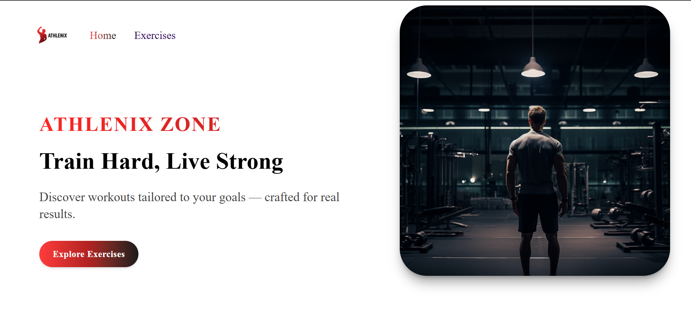

🏋️‍♂️ Athlenix Zone – Gym Landing Page
Athlenix Zone is a modern, fully responsive, animated gym landing page built with React, Tailwind CSS, and GSAP. This project highlights frontend mastery with engaging animations, responsive layout, clean code structure, and a polished user experience.

📌 Features
✅ Smooth scroll-triggered animations using GSAP + ScrollTrigger

✅ Fully responsive design (Mobile, Tablet, Desktop)

✅ Modern Hero section with animated headings

✅ Feature Highlights with animated cards

✅ Testimonials / Transformations slider

✅ Flexible Membership Plans

✅ Interactive FAQ section

✅ Strong CTA (Call to Action) section

✅ Footer with smooth layout & branding

✅ Clean & modular component structure

🛠️ Built With
React (v18+)

Tailwind CSS (v4)

GSAP (ScrollTrigger, Context)

Vite (for fast dev environment)

📁 Folder Structure
src/
├── Components/
│   ├── Navbar.jsx
│   ├── HeroBanner.jsx
│   ├── Features.jsx
│   ├── Testimonials.jsx
│   ├── Membership.jsx
│   ├── FAQS.jsx
│   ├── Stats.jsx
│   ├── CTA.jsx
│   ├── Footer.jsx
│   └── Loader.jsx
├── assets/
│   └── images/, svgs/
├── App.jsx
├── main.jsx
└── index.css

💡 Getting Started
1. Clone the Repo
git clone https://github.com/your-username/athlenix-zone.git
cd athlenix-zone
2. Install Dependencies
npm install
3. Start Development Server
npm run dev
4. Build for Production
npm run build

📃 License
This project is open-source and free to use.
Feel free to fork and customize it to suit your own portfolio!
Krishna Sahu
Frontend Developer | JavaScript + React Enthusiast
Email:krishna.sahu.work@gmail.com